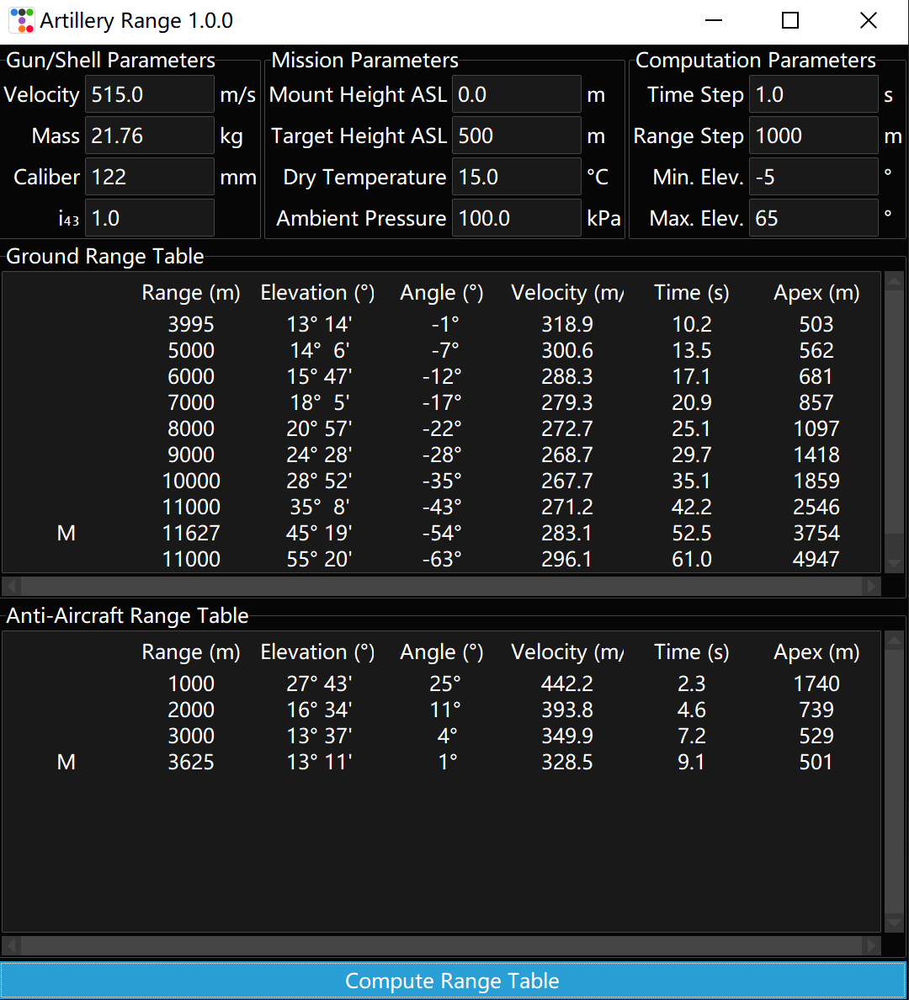

# artillery_range_table
Python GUI tool to generate simplified range table for artillery.

Trajectories are computed assuming dry, ICAO standard atmosphere up to 80 km, 
on a non-rotating Earth. Projectile drag modelled using similitude factor 
to the 1943 drag curve for rotating projectiles. 



## Instruction

### Run GUI Independently
On Windows machines, download the latest executable from the release channel. 

### Install & Run as Python library

#### Without GUI
Ensure Python (version >= 3.9) is installed. Clone this repository, and run:
```shell
pip install .
```
Then, in Python programs, the scripts may be imported as:
```python
from exterior_ballistics import trajectory, rangetable
```

#### With GUI
If it is desired to use the graphical user interface, run:
```shell
pip install .[gui]
```
The script's entry point is:
```shell
rangetables
```

## Dependencies
Core dependency includes:
 - `tabulate` for outputting range table.

GUI script additionally requires:
 - `ttkbootstrap` for bringing the `tkinter` GUI up to modern sensibilities.  

Generating Binary requires:
 - `auto-py-to-exe` which wraps `pyinstaller` to generate one-file self extracting executable
on Windows machines.

## Development
Additional requirements for development:
 - `black` for code formatting.
 - `auto-py-to-exe` for generating windows executable.